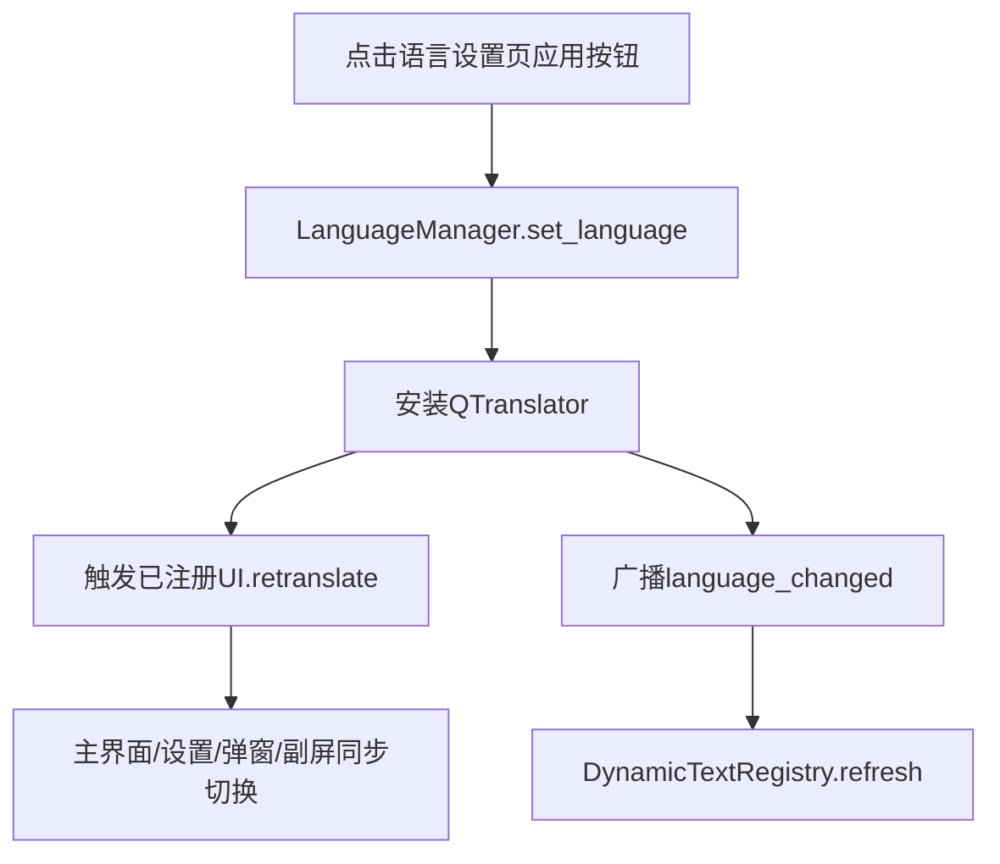

# 全系统语言切换设计文档

## 目标

- 点击语言设置页“应用”后，**主界面 + 设置页 + 所有弹窗 + 副屏 + 运行中动态文案**统一切换到所选语言。
- 语言选择可持久化（下次启动自动恢复）。

## 现状分析

- 主入口为 [`main_1080_mata.py`](main_1080_mata.py)；语言设置页面为 [`control/order_language_settings.py`](control/order_language_settings.py) + [`ui_1080_py/Ui_language_settings_ui.py`](ui_1080_py/Ui_language_settings_ui.py)。
- 主要 UI 的 `retranslateUi` 已由 PyQt5 生成（见 `ui_1080_py` 下多个文件）。
- 动态文案大量来自 `setText()`、`setWindowTitle()` 等（见 [`control/`](control) 下多处）。

## 设计方案总览

1) 引入 **LanguageManager**（集中管理翻译文件加载、安装/移除 `QTranslator`、广播重翻译）。
2) 建立 **UI 注册表**：所有已创建窗口/弹窗/副屏实例注册到管理器，以便统一触发 `retranslateUi`。
3) 对 **动态文案** 做集中处理：建立 `DynamicTextRegistry`，在语言切换时重新计算并刷新文本。
4) 使用 `QSettings` **持久化语言**，启动时自动恢复。

## 组件设计

### A. LanguageManager

职责：

- 加载 `.qm` 文件（例如 `i18n/zh_TW.qm`）
- 安装/移除 `QTranslator`
- 触发所有已注册 UI 的 `retranslate`
- 广播信号让动态文案刷新

接口（伪代码）：

```python
class LanguageManager(QObject):
    language_changed = pyqtSignal(str)

    def __init__(self, app: QApplication, settings: QSettings): ...

    def register_ui(self, key: str, retranslate_cb: Callable[[], None]): ...
    def unregister_ui(self, key: str): ...

    def set_language(self, lang_code: str): ...
    def load_on_startup(self): ...
```

### B. UI 注册表

注册时机：

- 主界面创建后：注册主界面 `retranslateUi`
- 设置页创建后：注册设置首页、语言页、各子页面
- 弹窗创建时：注册其 `retranslateUi`；销毁时 `unregister`
- 副屏创建时：注册副屏 `retranslateUi`

注册示例（伪代码）：

```python
lang_manager.register_ui(
  key="main",
  retranslate_cb=lambda: self.retranslateUi(self)
)
```

### C. 动态文案处理

问题：运行中大量 `setText()` 直接写死中文，不会受 `retranslateUi` 影响。

解决：

- 建立 `DynamicTextRegistry`，保存动态文案的“原始 key + 计算函数 + 目标控件”。
- 语言切换时统一刷新。

示例：

```python
registry.bind(
  key="menu_upload_success",
  widget=self.status_label,
  render=lambda filename: tr("menu_upload_success", filename=filename)
)
```

## 覆盖范围清单

### 主界面/设置

- [`main_1080_mata.py`](main_1080_mata.py)（主 UI、设置主页、设置子页）

### 弹窗

- [`control/order_dialog_1_mata.py`](control/order_dialog_1_mata.py)
- [`control/message_dialog_mata.py`](control/message_dialog_mata.py)
- [`control/conduit_dialog_mata.py`](control/conduit_dialog_mata.py)
- [`control/conduit_new_dialog_mata.py`](control/conduit_new_dialog_mata.py)
- [`control/menu_update_mata.py`](control/menu_update_mata.py)
- 其他 `control/*.py` 中创建的 `QDialog/QWidget` 弹窗

### 副屏

- [`control/second_screen_mata.py`](control/second_screen_mata.py)
- [`ui_1080_py/Ui_second_screen_ui.py`](ui_1080_py/Ui_second_screen_ui.py)

### 动态文案初步命中点（需进一步整理）

- [`control/message_dialog_mata.py`](control/message_dialog_mata.py)
- [`control/menu_update_mata.py`](control/menu_update_mata.py)
- [`control/conduit_new_dialog_mata.py`](control/conduit_new_dialog_mata.py)
- [`control/maketee_control.py`](control/maketee_control.py)
- [`control/order_card_mata.py`](control/order_card_mata.py)

## 数据持久化

使用 `QSettings` 保存语言码：

```
settings.setValue("i18n/lang", "zh_TW")
```

启动时读取并自动应用。

## 交互流程



## 实施步骤

1) 新增 `LanguageManager` 与 `DynamicTextRegistry`
2) 在主入口创建单例并注入到各模块
3) 主界面/设置页注册 retranslate
4) 弹窗/副屏创建时注册，销毁时注销
5) 替换动态文案：集中映射到 `tr()` 调用
6) 语言设置页应用按钮发出 lang_code
7) QSettings 持久化与启动加载
8) 覆盖测试与补漏

