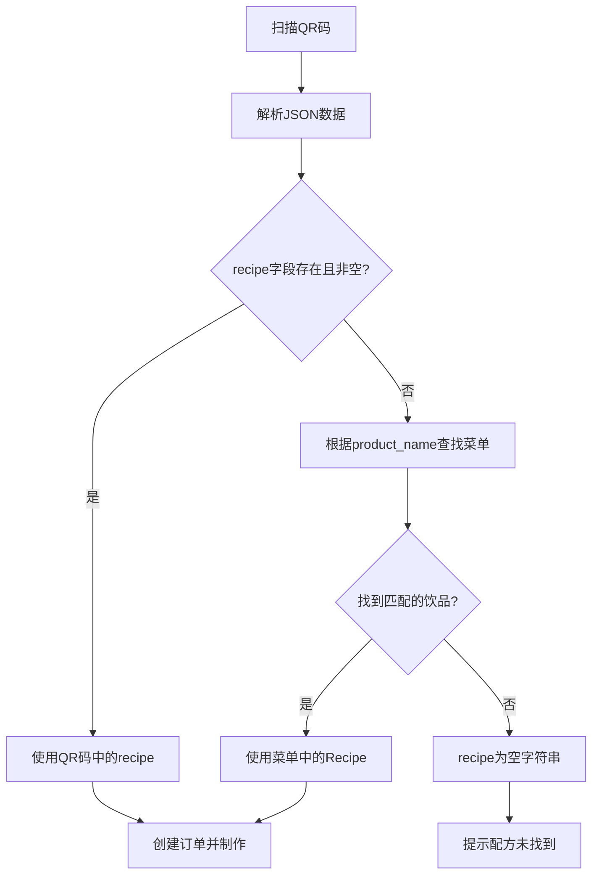

# QR码扫描配方自动获取功能实施计划

## 需求概述

用户希望修改QR码扫描出茶功能：
- **当前状态**：QR码包含完整的配方数据（`recipe` 字段）
- **目标状态**：QR码不再包含 `recipe` 字段，程序根据 `product_name` 自动从 `tea_drinks_menu.json` 获取配方

### QR码数据格式变化

**修改前**：
```json
{
  "product_name": "绿豆八宝粥",
  "product_sugar": "常规",
  "product_quantity": "中杯",
  "product_ice": "少冰",
  "product_simp": "脆啵啵,芋圆",
  "unit_price": "18.0",
  "recipe": "A100E100H100W100"
}
```

**修改后**：
```json
{
  "product_name": "绿豆八宝粥",
  "product_sugar": "常规",
  "product_quantity": "中杯",
  "product_ice": "少冰",
  "product_simp": "脆啵啵,芋圆",
  "unit_price": "18.0"
}
```

## 技术分析

### 关键文件

| 文件 | 作用 |
|------|------|
| `main_1080_mata.py` | 主程序，包含 `callBack_camera_info_result` 函数处理QR码数据 |
| `menu_xlsx/tea_drinks_menu.json` | 菜单配置文件，包含饮品名称和配方映射 |

### 关键代码位置

- **第 5081 行**：`tee_bean.recipe = self.camera_data.get("recipe", "")`
  - 这是从QR码数据获取配方的位置
  - 需要修改为：当 `recipe` 为空时，从菜单JSON获取

### 菜单JSON结构

```json
[
  {
    "ID": "002",
    "Name": "柠檬红茶",
    "Recipe": "冰220 碎冰220 红茶100 水150 果糖15 果蜜20",
    "Base Price": 12,
    ...
  }
]
```

## 实施方案

### 步骤 1：添加配方查找函数

在 `main_1080_mata.py` 中添加一个新函数，根据饮品名称从菜单获取配方：

```python
def get_recipe_by_name(product_name: str) -> str:
    """根据饮品名称从 tea_drinks_menu.json 获取配方"""
    if not product_name:
        return ""
    try:
        mp = _menu_path()
        if not os.path.exists(mp):
            return ""
        with open(mp, "r", encoding="utf-8") as f:
            items = json.load(f) or []
        # 查找匹配的饮品
        name_norm = product_name.strip()
        for item in items:
            if str(item.get("Name", "")).strip() == name_norm:
                return str(item.get("Recipe", "")).strip()
    except Exception as e:
        print(f"[ERR] get_recipe_by_name: {e}")
    return ""
```

### 步骤 2：修改 callBack_camera_info_result 函数

修改第 5081 行附近的代码：

**修改前**：
```python
tee_bean.recipe = self.camera_data.get("recipe", "")
```

**修改后**：
```python
# 优先使用QR码中的recipe，若为空则从菜单获取
qr_recipe = self.camera_data.get("recipe", "").strip()
if qr_recipe:
    tee_bean.recipe = qr_recipe
else:
    tee_bean.recipe = get_recipe_by_name(tee_bean.product_name)
```

## 流程图



## 兼容性考虑

1. **向后兼容**：如果QR码仍包含 `recipe` 字段，优先使用QR码中的配方
2. **容错处理**：如果菜单中找不到对应饮品，返回空字符串，后续制作流程会提示错误
3. **与手动出茶一致**：使用相同的菜单数据源，确保配方一致性

## 测试要点

1. 扫描不含 `recipe` 的QR码，验证能正确从菜单获取配方
2. 扫描含 `recipe` 的QR码，验证仍使用QR码中的配方
3. 扫描菜单中不存在的饮品名称，验证错误处理
4. 验证冰量、糖量调整逻辑仍正常工作
